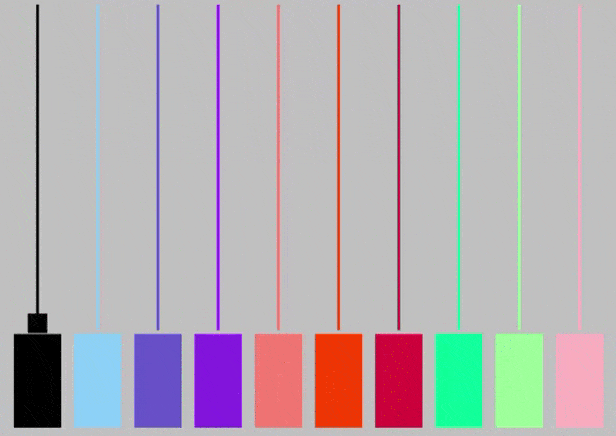

# P7. Sound. Pseudopiano

### Autor: Jonay Suárez Ramírez

## Descripción

En este proyecto se ha desarrollado una pequeña aplicación que simula un pseudopiano. Está inspirado en parte por el popular juego de Guitar Hero, donde las notas que se deben tocar se acercan en distintas pistas de la parte superior de la pantalla a la inferior.

En este caso se puede usar el teclado como piano o el ratón para pulsar las distintas teclas.

Al pulsar una tecla se emite el sonido de una nota y también se muestra en pantalla un cuadrado sobre la pista que corresponde a la tecla. Este cuadrado se va desplazando hacia la parte superior hasta que sale de la pantalla.

## Requisitos

- Dispositivo de audio.

## Controles
- La primera línea de letras del teclado. ( `Q, W, E, R, T, Y, U, I, O, P` )
- Ratón. También se puede pulsar sobre las teclas del "piano" o sobre las "pistas".

## Referencias y Herramientas

1. Librería MINIM http://code.compartmental.net/tools/minim/.

2. Guión de prácticas de CIU.

3. Documentación online de Processing.

4. Gif creado con https://www.online-convert.com/es .

## Resultado

